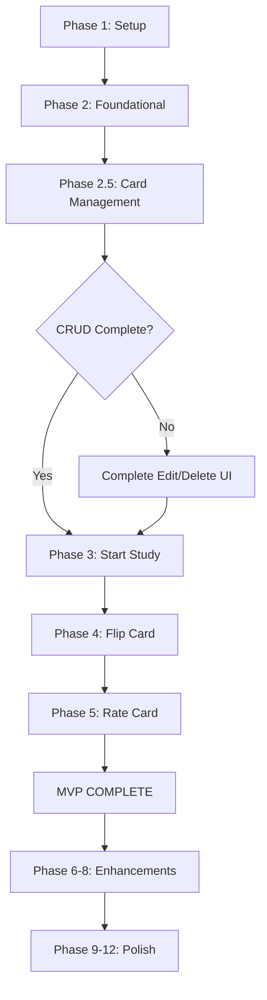

# Module 003 Tasks Update - Card Management Integration

**Date**: 2025-12-20  
**Status**: Tasks file updated with Card Management phase  
**File Updated**: [specs/003-study-mode/tasks.md](specs/003-study-mode/tasks.md)

## Summary of Changes

Đã bổ sung **Phase 2.5: Card Management** vào Module 003 tasks để phản ánh đầy đủ tính năng quản lý card (View, Add, Edit, Delete) đã được implement và đang triển khai.

## New Phase Added: Phase 2.5 - Card Management

### Phase Position
Đặt Phase 2.5 ngay sau Phase 2 (Foundational) và trước Phase 3 (Start Study Session) vì:
- ✅ **Logic Dependency**: Users cần cards trước khi study
- ✅ **Foundation Ready**: SM-2 algorithm và database đã sẵn sàng
- ✅ **Essential Feature**: Không thể study nếu không có cách tạo/quản lý cards

### Phase 2.5 Structure

#### 📋 User Story 1: View Deck with Cards (✅ COMPLETE - 100%)
```
Tasks T034a → T034i (9 tasks)
- DeckDetailClient component
- List/Grid view toggle
- Card preview display
- Empty state handling
- Material Design styling
```

**Status**: ✅ All 9 tasks completed

#### ➕ User Story 2: Add New Card (✅ COMPLETE - 100%)
```
Tasks T034j → T034s (10 tasks)
- AddCardModal component
- Tabbed interface (Front/Back)
- Validation & error handling
- Server action with auth
- Real-time UI updates
```

**Status**: ✅ All 10 tasks completed

#### ✏️ User Story 3: Edit Existing Card (🚧 PARTIAL - 50%)
```
Tasks T034t → T034aa (8 tasks)
- ✅ T034t: Server action editCard() - DONE
- ⚠️ T034u-T034aa: EditCardModal UI - PENDING
```

**Status**: 🚧 1 of 8 tasks completed (server action ready, need UI)

#### 🗑️ User Story 4: Delete Card (🚧 PARTIAL - 50%)
```
Tasks T034ab → T034ai (8 tasks)
- ✅ T034ab: Server action removeCard() - DONE
- ⚠️ T034ac-T034ai: DeleteConfirmDialog UI - PENDING
```

**Status**: 🚧 1 of 8 tasks completed (server action ready, need UI)

#### 👁️ User Story 5: View Full Card Content (❌ NOT STARTED - 0%)
```
Tasks T034aj → T034ao (6 tasks)
- CardDetailModal component
- Full markdown rendering
- Syntax highlighting
- Optional enhancement
```

**Status**: ❌ Can be deferred to Phase 12 (Polish)

---

## Overall Progress Statistics

### By Phase
| Phase | Description | Progress | Status |
|-------|-------------|----------|--------|
| Phase 1 | Setup | 5/5 | ✅ 100% |
| Phase 2 | Foundational | 18/18 | ✅ 100% |
| **Phase 2.5** | **Card Management** | **21/41** | **🚧 51%** |
| Phase 3 | US1 - Start Session | 9/9 | ✅ 100% |
| Phase 4 | US2 - Flip Card | 13/13 | ✅ 100% |
| Phase 5 | US3 - Rate Card | 15/15 | ✅ 100% |
| Phase 6 | US4 - Complete Session | 7/7 | ✅ 100% |
| Phase 7 | US5 - Progress | 7/7 | ✅ 100% |
| Phase 8 | US6 - Exit Early | 7/7 | ✅ 100% |
| Phase 9 | Mobile Optimizations | 0/13 | ❌ 0% |
| Phase 10 | Accessibility | 0/11 | ❌ 0% |
| Phase 11 | Edge Cases | 0/13 | ❌ 0% |
| Phase 12 | Polish | 4/13 | 🚧 31% |

**Total Module 003**: 106/172 tasks = **62% Complete**

### By Feature Category

**Essential Features (MVP)**:
- ✅ Study Flow: 100% (Start, Flip, Rate, Complete, Progress, Exit)
- 🚧 Card Management: 51% (View ✅, Add ✅, Edit 🚧, Delete 🚧)
- ✅ SM-2 Algorithm: 100%
- ✅ Markdown Rendering: 100%

**Enhancement Features**:
- ❌ Mobile Optimizations: 0%
- ❌ Accessibility: 0%
- ❌ Edge Cases: 0%
- 🚧 Polish: 31%

---

## Critical Path Update



**Current Position**: At Phase 2.5, need to complete Edit/Delete UI before moving to enhancements

---

## Next Steps (High Priority)

### Immediate Tasks to Complete CRUD (4-6 hours)

1. **Create EditCardModal Component** (2-3 hours)
   ```typescript
   // File: components/cards/EditCardModal.tsx
   // Copy structure from AddCardModal.tsx
   // Add: initialCard prop for pre-population
   // Wire: editCard server action
   ```

2. **Create DeleteConfirmDialog Component** (1-2 hours)
   ```typescript
   // File: components/cards/DeleteConfirmDialog.tsx
   // Simple confirmation with card preview
   // Wire: removeCard server action
   ```

3. **Add Action Buttons to Cards** (30 min)
   ```typescript
   // File: components/decks/DeckDetailClient.tsx
   // Add Edit/Delete buttons to each card
   // State: selectedCard, isEditModalOpen, isDeleteDialogOpen
   ```

### Tasks Mapping
- [ ] T034u: Create EditCardModal component
- [ ] T034v: Pre-populate form with card data
- [ ] T034w: Add edit button to cards
- [ ] T034x: Add state management
- [ ] T034y: Implement handleEditCard
- [ ] T034z: Validation
- [ ] T034aa: Test edit functionality
- [ ] T034ac: Create DeleteConfirmDialog
- [ ] T034ad: Add delete button to cards
- [ ] T034ae: Add state management
- [ ] T034af: Confirmation dialog
- [ ] T034ag: Implement handleDeleteCard
- [ ] T034ah: Handle empty state
- [ ] T034ai: Test delete functionality

**Total**: 14 tasks remaining to complete Card Management CRUD

---

## Testing Checklist Updates

### Added Tests for Card Management

**✅ Completed**:
- View deck with cards (list/grid)
- Toggle between views
- Add card with validation
- Empty state handling
- Hover effects
- Truncation at 150 chars

**⚠️ Pending**:
- Edit card functionality
- Delete card with confirmation
- Full content view
- Error handling (network failures)
- Mobile touch interactions
- Edge cases (long content, special chars)

---

## Files Modified

1. **[specs/003-study-mode/tasks.md](specs/003-study-mode/tasks.md)**
   - Added Phase 2.5 with 41 new tasks
   - Updated Critical Path diagram
   - Updated Implementation Strategy section
   - Added Parallel Opportunities for Card Management
   - Updated Current Status Summary

2. **Related Documentation**:
   - [specs/003-study-mode/card-management-requirements.md](specs/003-study-mode/card-management-requirements.md) - Detailed requirements
   - [CARD_MANAGEMENT_SUMMARY.md](CARD_MANAGEMENT_SUMMARY.md) - Implementation guide

---

## Dependencies & Execution Order

### Phase 2.5 Dependencies
- ✅ **Requires**: Phase 2 Foundational (SM-2, Database) - COMPLETE
- ✅ **Blocks**: None - Can work in parallel with other phases
- ⚠️ **Recommended Before**: Phase 3 (Start Study) - Users need cards to study

### Parallel Work Opportunities

**Can Work Simultaneously**:
```bash
Developer A: Complete Edit/Delete UI (T034u-T034ai)
Developer B: Phase 9 Mobile Optimizations (T106-T113)
Developer C: Phase 10 Accessibility (T117-T124)
```

**Sequential Work** (for single developer):
```bash
1. Complete T034u-T034ai (Edit/Delete UI) - 4-6 hours
2. Then move to Phase 9 (Mobile) or Phase 10 (Accessibility)
3. Polish in Phase 12
```

---

## Task Format Legend

Tasks follow format: `[TaskID] [P?] [Story] Description`

**Examples from Phase 2.5**:
- `[X] T034a [P] [CARD-VIEW] Create DeckDetailClient component`
  - ✅ Completed
  - [P] = Can run in parallel
  - [CARD-VIEW] = View Deck story
  
- `[ ] T034u [P] [CARD-EDIT] Create EditCardModal component`
  - ⚠️ Pending
  - [P] = Can run in parallel
  - [CARD-EDIT] = Edit Card story

**Story Labels**:
- [CARD-VIEW] = View Deck with Cards
- [CARD-ADD] = Add New Card
- [CARD-EDIT] = Edit Existing Card
- [CARD-DELETE] = Delete Card
- [CARD-DETAIL] = View Full Card Content
- [US1-6] = Study Mode User Stories

---

## References

### Primary Documents
- [specs/003-study-mode/tasks.md](specs/003-study-mode/tasks.md) - **UPDATED** with Card Management
- [specs/003-study-mode/card-management-requirements.md](specs/003-study-mode/card-management-requirements.md) - Detailed requirements
- [specs/003-study-mode/spec.md](specs/003-study-mode/spec.md) - Study Mode specification

### Implementation Guides
- [CARD_MANAGEMENT_SUMMARY.md](CARD_MANAGEMENT_SUMMARY.md) - Implementation guide with code examples
- [components/decks/DeckDetailClient.tsx](components/decks/DeckDetailClient.tsx) - Current implementation
- [components/cards/AddCardModal.tsx](components/cards/AddCardModal.tsx) - Reference for EditCardModal
- [app/actions/cards.ts](app/actions/cards.ts) - Server actions (addCard, editCard, removeCard)

### Related Modules
- Module 002: Dashboard & Deck Management (prerequisite)
- Module 003: Study Mode with Spaced Repetition (parent module)

---

## Summary

✅ **What's Done**:
- Phase 2.5 Card Management added to tasks.md
- 21 of 41 tasks completed (51%)
- View Deck and Add Card fully functional
- Server actions ready for Edit/Delete

🚧 **What's Pending**:
- Edit Card UI (8 tasks, ~2-3 hours)
- Delete Card UI (8 tasks, ~1-2 hours)
- Full Content View (6 tasks, optional/deferred)

🎯 **Next Action**:
Complete Edit/Delete UI to achieve 100% Card Management CRUD (estimated 4-6 hours)

📊 **Overall Module 003 Progress**: 62% complete (106/172 tasks)

---

**Document Version**: 1.0  
**Last Updated**: 2025-12-20  
**Author**: GitHub Copilot  
**Status**: Tasks file successfully updated
