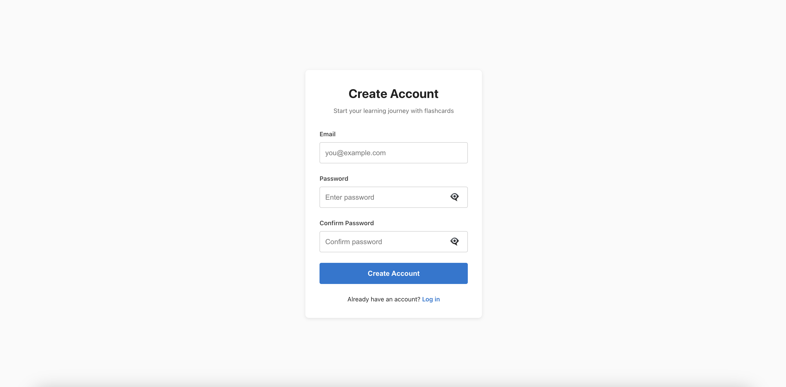
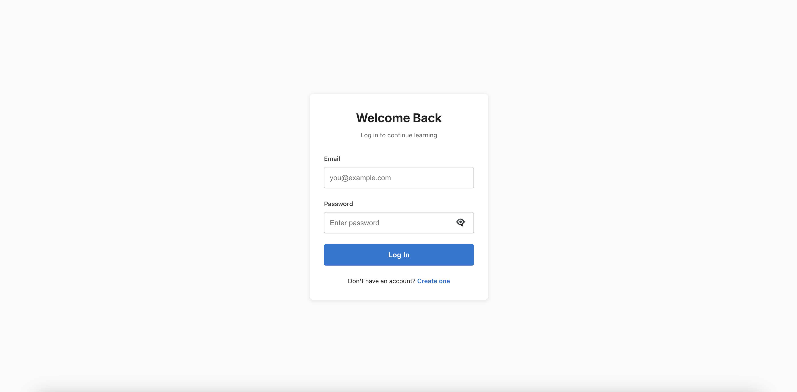
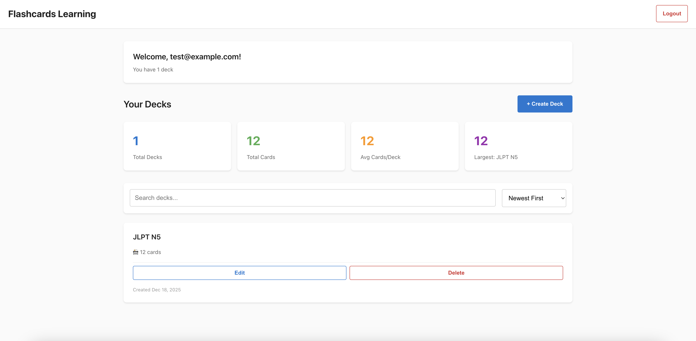
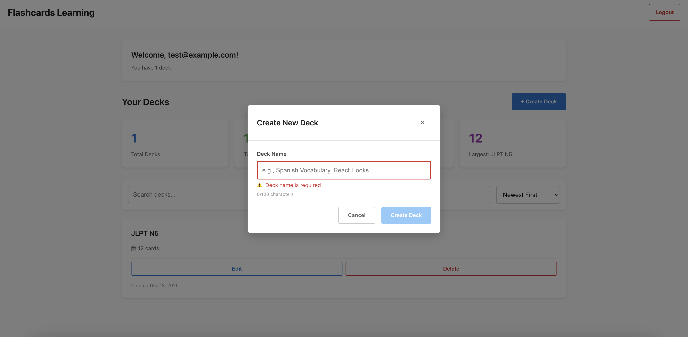
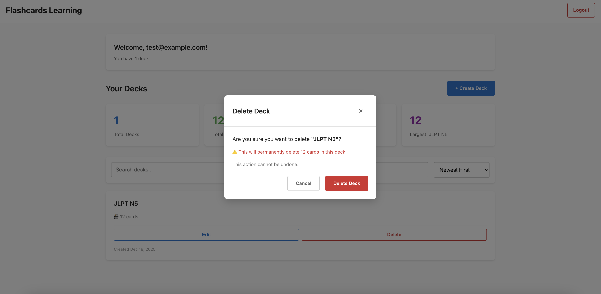
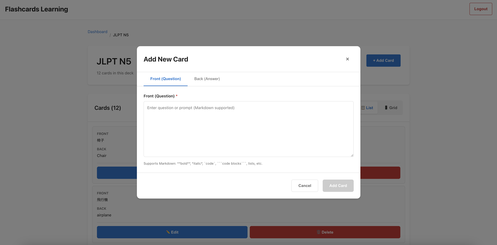
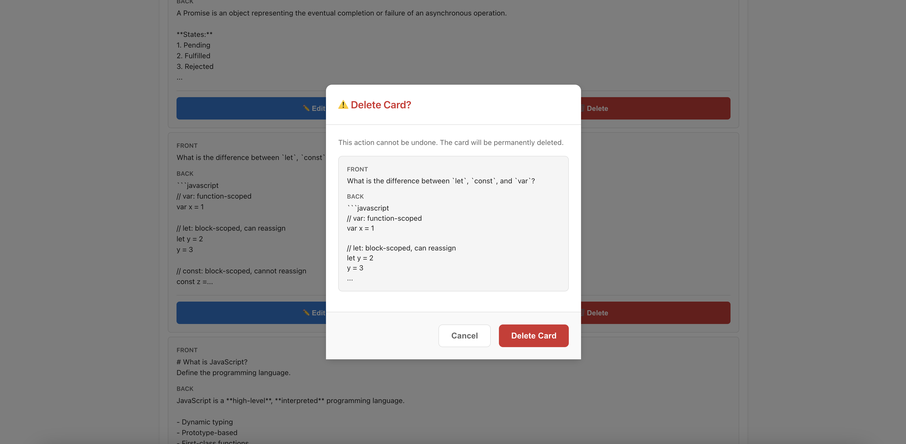
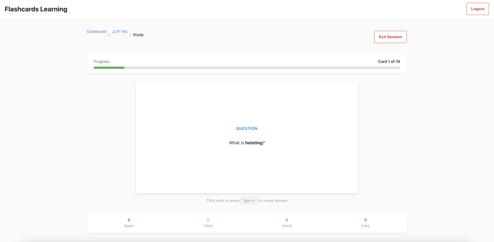
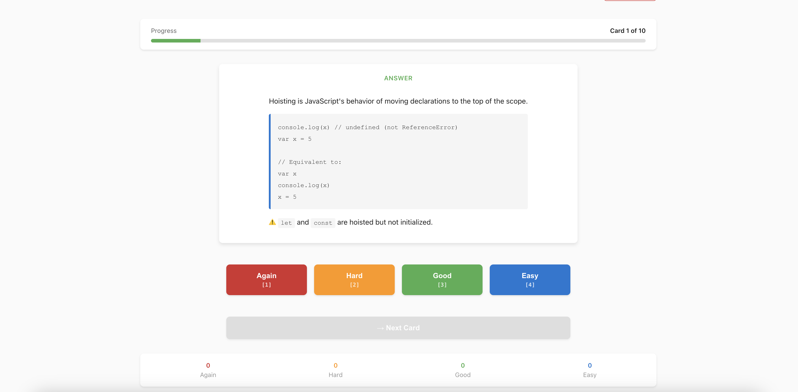
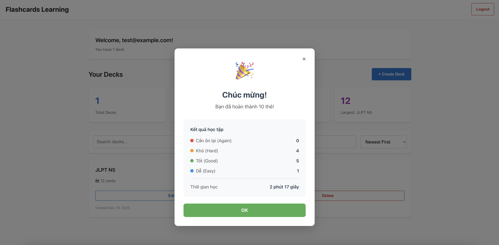

# Hướng Dẫn Sử Dụng - Flashcards Learning

**Phiên bản**: 1.1  
**Cập nhật**: 19/12/2025

Chào mừng bạn đến với **Flashcards Learning**! Hướng dẫn này sẽ giúp bạn làm chủ ứng dụng, từ việc tạo tài khoản đến việc học tập hiệu quả với thuật toán lặp lại ngắt quãng (Spaced Repetition).

---

## 🚀 User Story 1: Bắt Đầu - Đăng Ký & Đăng Nhập

### 1.1. Đăng Ký Tài Khoản Mới

**Mục tiêu**: Tạo một tài khoản mới để bắt đầu hành trình học tập của bạn.

**Các bước thực hiện**:

1.  **Truy cập trang Đăng ký**: Mở ứng dụng và chọn "Register".
2.  **Điền thông tin**:
    - **Email**: Nhập email hợp lệ của bạn.
    - **Password**: Tạo một mật khẩu mạnh (tối thiểu 8 ký tự, có chữ hoa, chữ thường, số và ký tự đặc biệt).
3.  **Nhấn "Register"**: Hoàn tất việc tạo tài khoản.

**Kết quả**: Bạn sẽ được tự động đăng nhập và chuyển đến trang Dashboard chính.

---

### 1.2. Đăng Nhập Vào Tài Khoản

**Mục tiêu**: Truy cập lại vào tài khoản đã có để tiếp tục học.

**Các bước thực hiện**:

1.  **Truy cập trang Đăng nhập**: Mở ứng dụng và chọn "Login".
2.  **Nhập thông tin**: Điền email và password đã đăng ký.
3.  **Nhấn "Login"**: Truy cập vào tài khoản của bạn.

**Kết quả**: Bạn sẽ thấy trang Dashboard với tất cả các bộ thẻ của mình. Phiên đăng nhập của bạn sẽ được duy trì trong 24 giờ.

---

## 📚 User Story 2: Dashboard - Quản Lý Bộ Thẻ (Decks)

### 2.1. Xem Toàn Bộ Bộ Thẻ

**Mục tiêu**: Xem tổng quan tất cả các bộ thẻ bạn đã tạo.

**Mô tả**: Ngay sau khi đăng nhập, Dashboard sẽ hiển thị các bộ thẻ của bạn dưới dạng một lưới (grid) trực quan. Mỗi thẻ trong lưới hiển thị:
- Tên bộ thẻ.
- Số lượng thẻ bên trong (ví dụ: "15 cards").

*Nếu bạn chưa có bộ thẻ nào, một thông báo thân thiện sẽ hướng dẫn bạn tạo bộ thẻ đầu tiên.*

---

### 2.2. Tạo một Bộ Thẻ Mới

**Mục tiêu**: Tạo một không gian mới để chứa các thẻ học cho một chủ đề cụ thể.

**Các bước thực hiện**:

1.  **Nhấn nút "Create Deck"**: Nút này luôn có sẵn trên Dashboard.
2.  **Nhập tên**: Một cửa sổ (modal) sẽ hiện ra, yêu cầu bạn nhập tên cho bộ thẻ mới (ví dụ: "Từ vựng Tiếng Anh Giao Tiếp").
3.  **Nhấn "Create"**: Hoàn tất việc tạo.

**Kết quả**: Bộ thẻ mới sẽ ngay lập tức xuất hiện trên Dashboard của bạn với "0 cards".

---

### 2.3. Chỉnh Sửa & Xóa Bộ Thẻ

**Mục tiêu**: Cập nhật tên hoặc loại bỏ những bộ thẻ không còn cần thiết.

**Các bước thực hiện**:

- **Để chỉnh sửa**: Di chuột qua bộ thẻ và nhấn vào **icon bút chì (✏️)**.
- **Để xóa**: Di chuột qua bộ thẻ và nhấn vào **icon thùng rác (🗑️)**.

**Lưu ý quan trọng khi xóa**:
- Một hộp thoại xác nhận sẽ xuất hiện để đảm bảo bạn không xóa nhầm.
- **Hành động xóa là vĩnh viễn** và sẽ xóa tất cả các thẻ bên trong bộ thẻ đó.

---

## 🃏 User Story 3: Chi Tiết Bộ Thẻ - Quản Lý Thẻ (Cards)

### 3.1. Xem & Thêm Thẻ Mới

**Mục tiêu**: Xem các thẻ trong một bộ thẻ và thêm nội dung học tập mới.

**Các bước thực hiện**:

1.  **Mở bộ thẻ**: Nhấn vào một bộ thẻ bất kỳ trên Dashboard.
2.  **Xem danh sách thẻ**: Bạn sẽ thấy tất cả các thẻ hiện có trong bộ.
3.  **Nhấn "Add Card"**: Một cửa sổ sẽ hiện ra để bạn nhập nội dung cho thẻ mới.
    - **Front**: Mặt trước của thẻ (câu hỏi, thuật ngữ).
    - **Back**: Mặt sau của thẻ (câu trả lời, định nghĩa).
4.  **Nhấn "Add Card"** trong cửa sổ để lưu lại.

**Hỗ trợ Markdown**: Bạn có thể sử dụng Markdown để định dạng nội dung thẻ của mình (in đậm, in nghiêng, danh sách, khối mã, v.v.).

---

### 3.2. Chỉnh Sửa & Xóa Thẻ

**Mục tiêu**: Cập nhật hoặc loại bỏ các thẻ riêng lẻ.

**Các bước thực hiện**: Tương tự như quản lý bộ thẻ, mỗi thẻ sẽ có các nút **chỉnh sửa (Edit)** và **xóa (Delete)**.

- Nhấn **"Edit"** để mở cửa sổ và cập nhật nội dung thẻ.
- Nhấn **"Delete"** để xóa thẻ sau khi xác nhận.

---

## 🎯 User Story 4: Study Mode - Học Tập Thông Minh

### 4.1. Bắt Đầu Phiên Học

**Mục tiêu**: Bắt đầu một phiên học tập trung với thuật toán lặp lại ngắt quãng.

**Các bước thực hiện**:

1.  Trong trang chi tiết bộ thẻ, nhấn nút **"🎯 Start Studying"**.
2.  Hệ thống sẽ tự động chọn **ngẫu nhiên tối đa 10 thẻ** để bạn học.

**Kết quả**: Bạn sẽ được đưa vào giao diện học, với mặt trước của thẻ đầu tiên được hiển thị.

---

### 4.2. Lật Thẻ & Đánh Giá

**Mục tiêu**: Tự kiểm tra kiến thức và cung cấp phản hồi cho hệ thống.

**Flow học tập**:

1.  **Xem mặt trước**: Đọc câu hỏi và cố gắng nhớ lại câu trả lời.
2.  **Lật thẻ**: **Nhấn vào thẻ** để xem mặt sau (câu trả lời).
3.  **Tự đánh giá**: Sau khi xem câu trả lời, 4 nút đánh giá sẽ xuất hiện:
    - **🔴 Again**: Nếu bạn hoàn toàn không nhớ.
    - **🟠 Hard**: Nếu bạn nhớ nhưng rất khó khăn.
    - **🟢 Good**: Nếu bạn nhớ tương đối tốt.
    - **🔵 Easy**: Nếu bạn nhớ rất dễ dàng.
4.  **Chọn mức độ**: Nhấn vào nút phù hợp nhất với khả năng ghi nhớ của bạn.

---

### 4.3. Chuyển Thẻ & Hoàn Thành

**Mục tiêu**: Chuyển qua các thẻ trong phiên học và kết thúc khi hoàn tất.

**Các bước thực hiện**:

1.  **Sau khi chọn mức độ đánh giá**, nút **"Next"** sẽ được kích hoạt.
2.  **Nhấn "Next"**: Hệ thống sẽ lưu lại đánh giá của bạn, áp dụng thuật toán SM-2 để lên lịch ôn tập, và chuyển sang thẻ tiếp theo (hiển thị mặt trước).
3.  **Lặp lại** quy trình cho đến thẻ cuối cùng.
4.  **Tại thẻ cuối cùng**, nút "Next" sẽ được thay bằng nút **"Kết thúc"**.
5.  **Nhấn "Kết thúc"**: Phiên học của bạn hoàn tất.

**Kết quả khi hoàn thành**:
- Bạn sẽ được chuyển về trang Dashboard.
- Một **pop-up chúc mừng** sẽ hiện ra, tóm tắt kết quả phiên học của bạn (số lượng thẻ theo từng mức độ, tổng thời gian).

---

Chúc bạn có những giờ học hiệu quả và thú vị với **Flashcards Learning**! 🎓
